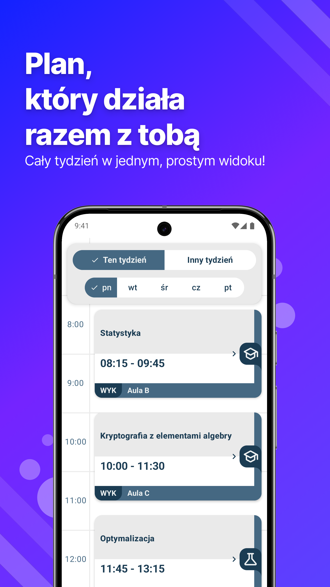
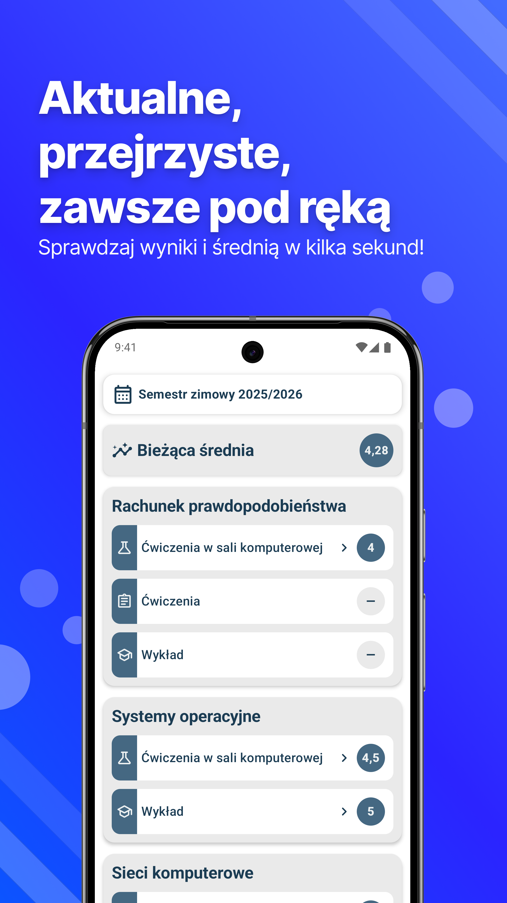
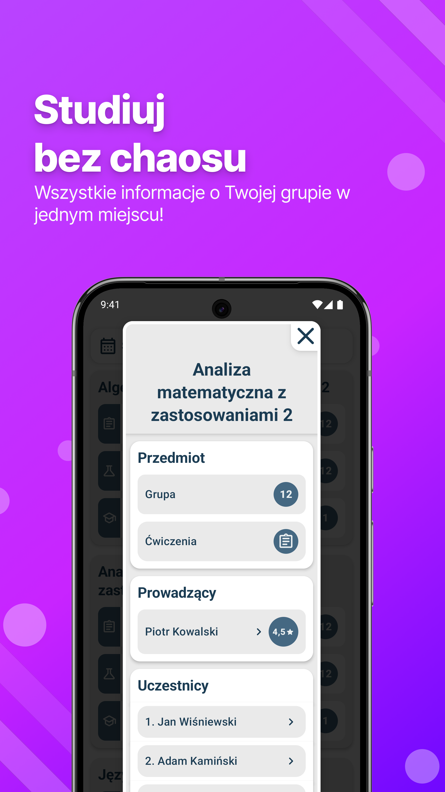
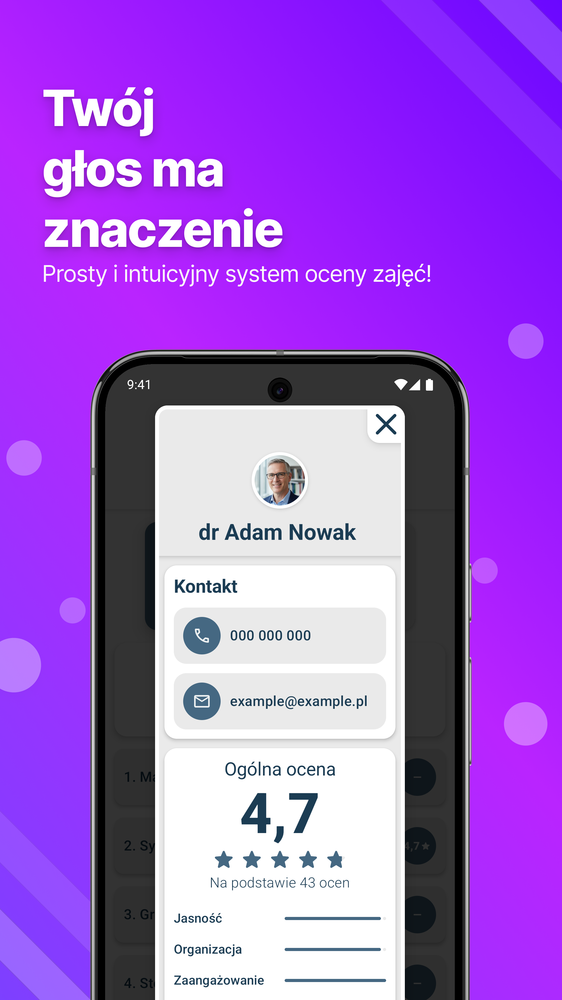

# mUniversity - Your Studies

  
  
  
  
  

## O aplikacji
Aplikacja **mUniversity** jest nieoficjalnym projektem studenckim służącym do przeglądania danych pozyskanych z USOS API. 

## Misja
Głównym założeniem rozwijanego projektu jest poprawa doświadczeń związanych z przeglądaniem podstawowych informacji dotyczących studiów oraz poprawa jakości kształcenia poprzez możliwość wystawiania ocen na temat jakości prowadzonych zajęć dydaktycznych. 

## Funkcjonalności
**mUniversity** w obecnej formie obsługuje konta studenckie USOS z uczelni Uniwersytet im. Adama Mickiewicza w Poznaniu oraz Politechnika Poznańska. Informacje wyświetlane to:
- Plan zajęć
- Lista ocen wraz ze średnią (liczona na podstawie średniej arytmetycznej wszystkich ocen z parametrem oznaczającym liczenie się do średniej ocen)
- Płatności
- Grupy zajęciowe - wyświetlane podstawowe informacje o grupie, prowadzącym zajęcia oraz uczestnikach
- Sprawdziany z dostępem do ocen oraz punktów
- System oceniania zajęć - w skali od 1 do 5 oceniane są podstawowe informacje takie jak: jasność tłumaczenia materiałów, jakość organizacji zajęć, zaangażowanie, sposób komunikacji ze studentami, sprawiedliwość i obiektywność oceniania. Oceny są prezentowane w formie zagregowanej przy każdym prowadzącym zajęcia.

# mUniversity - Your Studies

## O aplikacji
Aplikacja **mUniversity** jest nieoficjalnym projektem studenckim służącym do przeglądania danych pozyskanych z USOS API. 

## Misja
Głównym założeniem rozwijanego projektu jest poprawa doświadczeń związanych z przeglądaniem podstawowych informacji dotyczących studiów oraz poprawa jakości kształcenia poprzez możliwość wystawiania ocen na temat jakości prowadzonych zajęć dydaktycznych. 

## Funkcjonalności
**mUniversity** w obecnej formie obsługuje konta studenckie USOS z uczelni Uniwersytet im. Adama Mickiewicza w Poznaniu oraz Politechnika Poznańska. Informacje wyświetlane to:
- Plan zajęć
- Lista ocen wraz ze średnią (liczona na podstawie średniej arytmetycznej wszystkich ocen z parametrem oznaczającym liczenie się do średniej ocen)
- Płatności
- Grupy zajęciowe - wyświetlane podstawowe informacje o grupie, prowadzącym zajęcia oraz uczestnikach
- Sprawdziany z dostępem do ocen oraz punktów
- System oceniania zajęć - w skali od 1 do 5 oceniane są podstawowe informacje takie jak: jasność tłumaczenia materiałów, jakość organizacji zajęć, zaangażowanie, sposób komunikacji ze studentami, sprawiedliwość i obiektywność oceniania. Oceny są prezentowane w formie zagregowanej przy każdym prowadzącym zajęcia.
